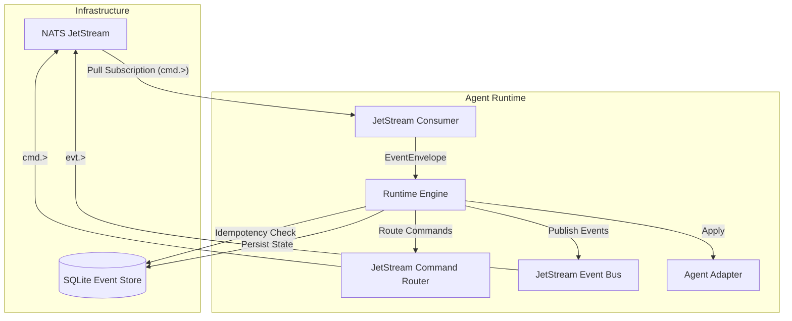
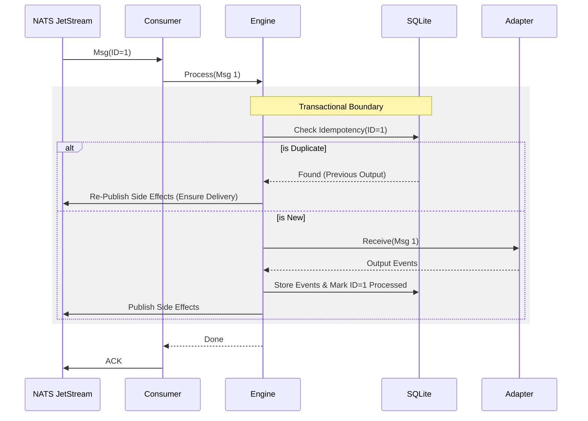

# Phase 0.13 Freeze: JetStream Durability & Crash Recovery

**Date:** 2024-05-23
**Status:** COMPLETED

## 1. Overview
This phase transitioned the MeshForge Runtime from ephemeral in-memory/NATS Core messaging to fully durable **JetStream** messaging. This ensures:
- **At-Least-Once Delivery**: No messages lost during network partitions or crashes.
- **Exactly-Once Processing**: Idempotency checks prevents duplicate side-effects.
- **Crash Recovery**: Agents can crash and restart without losing state or skipping commands.
- **Dead Letter Queues (DLQ)**: Poison pills are isolated after max retries.

## 2. Architecture

The Runtime now relies on NATS JetStream for both Command Routing and Event Publishing.



## 3. Durability Protocol

We implemented a strict "At-Least-Once -> Exactly-Once Effect" protocol.

### 3.1. The "Effect" Loop
1. **Receive**: Consumer pulls message from JetStream (Manual ACK mode).
2. **Process**: Engine checks Idempotency Key.
   - If **Duplicate**: 
     - Re-publish any side-effects (Events/Commands) that might have been lost if we crashed post-store but pre-publish last time.
     - Return saved result.
   - If **New**:
     - Call Adapter.
     - Persist State & Output Events to SQLite (Atomic Batch).
     - Publish Side-Effects to JetStream.
     - Mark Idempotency Key as processed.
3. **ACK**: Consumer sends ACK to JetStream *only* after successful processing & publishing.



### 3.2. Crash Recovery Scenarios

#### Scenario A: Crash BEFORE Store
- **State**: Not updated.
- **Action**: NATS Redelivers message.
- **Result**: Normal processing.

#### Scenario B: Crash AFTER Store, BEFORE Publish
- **State**: Updated in SQLite.
- **Action**: NATS Redelivers message (since no ACK was sent).
- **Result**:
  - Engine detects Idempotency.
  - **Critical Step**: Engine re-publishes side-effects found in Store.
  - Consumer ACKs.
  - Downstream receives events (At-Least-Once).

#### Scenario C: Crash AFTER Publish, BEFORE ACK
- **State**: Updated.
- **Action**: NATS Redelivers message.
- **Result**:
  - Engine detects Idempotency.
  - Re-publishes side-effects (Duplicates for downstream).
  - Consumer ACKs.

## 4. Dead Letter Queue (DLQ)

To prevent "poison pills" (messages that always crash the consumer) from blocking the queue indefinitely:

1. **Max Deliveries**: Configured to 5.
2. **Backoff**: Progressive backoff (1s, 5s, 10s...).
3. **Client-Side DLQ Logic**:
   - If `msg.metadata.num_delivered >= 5`:
     - Publish payload to `failed.<original_subject>` stream.
     - **ACK** original message to remove it from the work queue.
     - Log CRITICAL error.

## 5. Artifacts
- `meshforge_runtime.adapters.jetstream_bus`
- `meshforge_runtime.adapters.jetstream_router`
- `meshforge_runtime.adapters.jetstream_consumer`
- `tests/test_durability_jetstream.py`

## 6. Validation (Smoke Test)

A full integration test was performed using a generated workspace `meshforge-env-demo-nats-integration` with Docker Compose (NATS JetStream + Runtime).

### 6.1. Golden Command
```bash
# 1. Generate Integration Workspace
export PYTHONPATH=$PYTHONPATH:$(pwd)/meshforge-factory/src
python3 meshforge-factory/src/meshforge_factory/main.py generate \
    --prd meshforge-factory/examples/multi_agent_demo_prd.md \
    --profile test-nats \
    --output meshforge-env-demo-nats-integration

# 2. Start Environment
cd meshforge-env-demo-nats-integration
docker compose up -d --build

# 3. Run Smoke Test
# Requires nats-py
python3 tests/smoke_test.py
```

### 6.2. Execution Log
```text
Connecting to NATS at nats://localhost:4222...
Connected. Starting Smoke Test...

--- Step 1: Create Order (Command) ---
Subscribing to evt.default.demo.order.>...
Publishing to cmd.default.demo.order.create (ID=ef6992fc-3f41-4ed5-8829-09648054c965, Key=3a388f12-766b-480e-886d-07ee42d44c19)...
Waiting for evt.order.created...
Received Event: evt.order.created (ID=ef6992fc-3f41-4ed5-8829-09648054c965_created)
✅ Order Created Event Verified.

--- Step 2: Verify State (Gateway) ---
Publishing to cmd.default.demo.order.get for e0580df0-f466-4c41-a3f1-a748b4091445...
Received Event: evt.order.found
✅ Order State Verified via Bus.

--- Step 3: Idempotency Test (Exactly-Once) ---
Re-publishing the SAME Create Command (Same Idempotency Key)...
Received Event: evt.order.created (ID=ef6992fc-3f41-4ed5-8829-09648054c965_created)
✅ Idempotency: Event re-received.

--- Step 4: Inventory Interaction ---
Publishing to cmd.default.demo.inventory.create...
Received Event: evt.inventory.created
✅ Inventory Agent verified.

🎉 SMOKE TEST PASSED!
```
